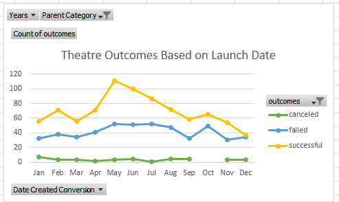
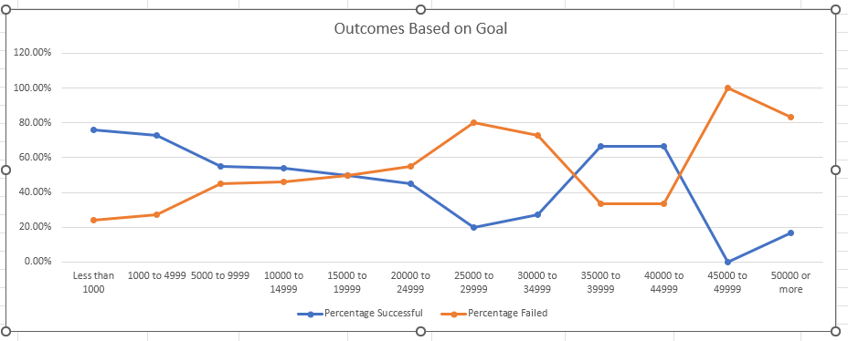

# Kickstarter-Anaylisis
Performing analysis with excel pivot tables to uncover trends and insights on the kickstart funding of theater plays.

## Overview of Project:
The analysis aims to visualize the outcomes of theater projects on Kickstarter based on their launch date and funding goal amount. Line charts were created using Excel to understand trends in success, failure, and cancellation rates of theater projects, and to inform decision-making for future projects.

## Analysis and Challenges:
Excel was used to create line charts for Theater Outcomes by Launch Date and Outcomes Based on Goals. COUNTIFS() and SUM() functions were used to collect and calculate data. Challenges included data formatting, chart customization, and limitations of Excel's options.

## Results:
Conclusions from the analysis are:

May and June have the highest number of successful theater projects, while December has the lowest.

As funding goal amount increases, the percentage of successful projects tends to decrease and the percentage of failed projects tends to increase.

## Limitations:
Limitations of the dataset include limited data and lack of context on project quality and external factors. Possible additional tables and graphs include bar charts, heatmaps, stacked column charts, and pie charts for further analysis of different categories, countries, pledge levels, and time periods.
